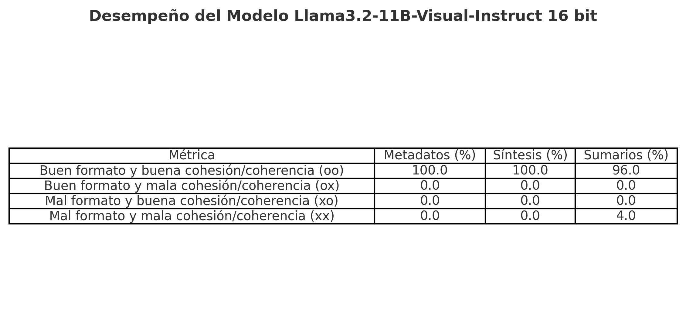

# Resumen Automático de Fallos Judiciales con LLMs

## Introducción
En el Boletín Judicial de los Tribunales Provinciales de Córdoba, un equipo liderado por la Dra. Valeria Sola trabaja en la extracción de metadatos, redacción de síntesis y elaboración de sumarios de fallos judiciales. Estas tareas se realizan manualmente sobre textos denominados [Fallos](https://drive.google.com/file/d/1M7qSGdbUqznr94c2qDan3uIS5SkR5TiE/view?usp=sharing), generando como resultado documentos denominados [Sumarios](https://drive.google.com/file/d/1yk6CjVThjc6iFP7Dw3XlPv6srfCkQhDi/view?usp=sharing). El objetivo es ofrecer documentos estandarizados que resumen causas legales en los fueros Civil y Penal, siguiendo las [Normas de estilo para la redacción de sumarios de jurisprudencia](https://drive.google.com/file/d/18NEBdtVR5UuGBziGEfFb1CA8ePUUsOnd/view?usp=sharing).

Este proceso manual es altamente demandante y consume tiempo que los abogados podrían dedicar a tareas más interpretativas. Este proyecto propone una herramienta automática que genere textos preliminares, permitiendo a los abogados centrarse en la validación, profundización y edición de los documentos generados, optimizando su esfuerzo y asegurando el cumplimiento de los estándares establecidos.

## Hipótesis y Objetivos Iniciales

La **hipótesis** sobre la que trabajamos desde el principio fue que podríamos generar **resúmenes útiles** para los abogados, tales que les ahorren una cantidad considerable de tiempo, solo usando **prompt engineering**, sin la necesidad de **fine-tunear** algún modelo.

## Resultados Finales

Los resultados obtenidos con el modelo **Llama3.2-11B-Visual-Instruct** en configuración de 16 bits se resumen en la siguiente tabla:

El modelo demostró un desempeño excelente en las tareas de extracción de metadatos y redacción de síntesis, alcanzando un 100% de buen formato y cohesión/coherencia. En la tarea de generación de sumarios, también obtuvo un desempeño destacado con un 96% de buen formato y cohesión/coherencia, aunque un 4% presentó problemas menores de formato y cohesión. El tiempo total de procesamiento fue de 31 minutos.

## Planificación y Ejecución
- **Planificación Inicial:** Explica cómo se estructuró el proyecto inicialmente (etapas, metas temporales).
- **Ejecución Real:** Compara lo planeado con lo efectivamente realizado, señalando desvíos o ajustes y sus razones.

## Exploración de Librerías y Codebases
- **Librerías Exploradas:** Lista las principales herramientas y librerías evaluadas.
- **Elección Final:** Justifica las elecciones finales con base en rendimiento, facilidad de uso u otros criterios relevantes.

## Relación con Trabajo Previo
- **Bibliografía:** Menciona artículos, papers o trabajos que influyeron en el proyecto.
- **Comparación:** Explica cómo tu trabajo se relaciona y se diferencia de lo existente.

## Feedback e Integración de Sugerencias
- **Comentarios Recibidos:** Resume las devoluciones de los otros dos grupos.
- **Implementación de Sugerencias:** Explica qué sugerencias se integraron y cuáles no, justificando estas decisiones.

## Metodología
- **Preprocesamiento:** Detalla cómo se procesaron los datos de entrada.
- **Arquitectura del Modelo:** Describe brevemente el modelo LLM utilizado y los ajustes realizados.
- **Entrenamiento/Inferencia:** Explica cómo se configuraron y ejecutaron estos procesos.

## Resultados
- **Métricas:** Presenta las métricas de evaluación utilizadas y los valores obtenidos.
- **Visualizaciones:** Incluye gráficos o tablas relevantes que respalden los resultados.

## Conclusiones y Trabajo Futuro
- Discute los aprendizajes clave del proyecto.
- Propón posibles mejoras o extensiones para futuros trabajos.

## Requisitos del Proyecto
Lista dependencias necesarias para ejecutar el proyecto.

## Uso
Instrucciones paso a paso para replicar o ejecutar el proyecto.

## Referencias
Incluye todas las citas y referencias bibliográficas usadas.

